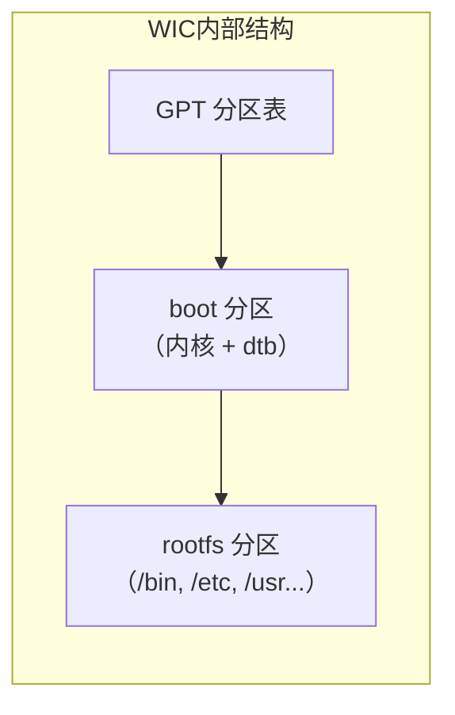
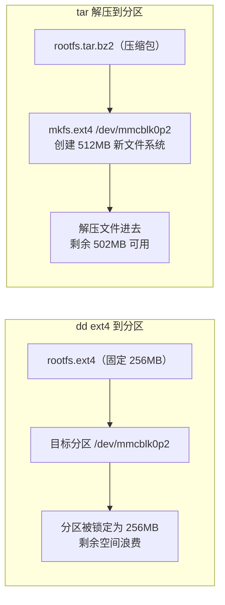
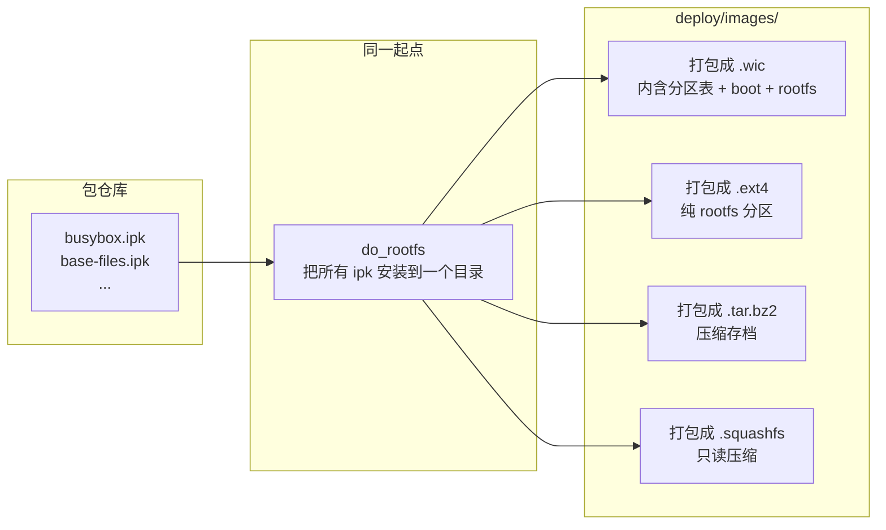
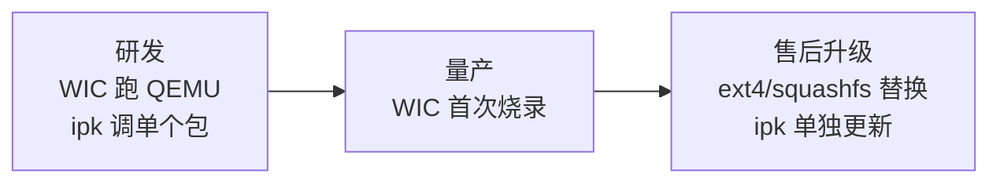

# Yocto 构建产物使用指南

## 概述

构建完成后，`tmp/deploy/` 下产出两类产物：**ipk/deb/rpm 包**（独立软件包）和 **wic/ext4/tar/squashfs/ubifs 镜像**（系统镜像）。本文说明它们的用途和使用方法。

---

## 一、包格式（Package Format）

每个 Recipe 构建完成后生成的**独立安装包**用何种格式打包，由 `PACKAGE_CLASSES` 决定：

```conf
# local.conf — 三选一
PACKAGE_CLASSES = "package_ipk"
```

| 格式 | 配置值 | 特点 | 包管理器 |
|------|--------|------|----------|
| **IPK** | `package_ipk` | 轻量，Yocto 默认推荐 | `opkg` |
| **DEB** | `package_deb` | Debian 系标准，生态成熟 | `dpkg` / `apt` |
| **RPM** | `package_rpm` | Red Hat 系标准，企业级 | `rpm` / `dnf` |

### 产出位置

```
tmp/deploy/ipk/                  # 或 deb/、rpm/
├── all/                         # 架构无关的包（Python 脚本等）
├── core2-64-poky-linux/         # 按架构分的包
│   ├── busybox_1.36.1.ipk
│   ├── busybox-httpd_1.36.1.ipk   # 一个 Recipe 可分割成多个包
│   └── busybox-syslog_1.36.1.ipk
└── qemux86_64-poky-linux/       # 机器特定的包
```

> 一个 Recipe 可以通过 `PACKAGES` 和 `FILES_` 变量把产物分割成多个包，这样根文件系统可以只安装需要的部分，节省空间。

### 使用方式

#### 方式一：通过包管理器安装到运行中的设备

把 `.ipk` 传到目标设备上，用 `opkg` 安装：

```bash
# 目标设备上（如 QEMU 或嵌入式板子）
opkg install busybox-httpd_1.36.1.ipk
opkg remove busybox-httpd
```

#### 方式二：搭建本地 opkg 仓库

Yocto 会自动生成包索引，你可以在目标设备上配置远程源：

```bash
# 目标设备上配置 /etc/opkg/arch.conf
src/gz local http://<你的IP>/ipk/
```

然后在 build 目录下启动 HTTP 服务：

```bash
cd tmp/deploy/ipk
python3 -m http.server 8000
```

#### 方式三：解压查看内容

```bash
# ipk 本质是 tar.gz 压缩包
mkdir /tmp/extract && cd /tmp/extract
ar x busybox_1.36.1.ipk          # 解出 control.tar.gz + data.tar.gz
tar -xf data.tar.gz               # 查看安装后的文件
ls ./bin/
```

---

## 二、镜像格式（Image Format）

镜像格式指最终生成的**可烧录文件**的格式，由 `IMAGE_FSTYPES` 控制：

```conf
# local.conf — 可同时生成多种格式
IMAGE_FSTYPES = "wic ext4 tar.bz2"
```

产出位置：`tmp/deploy/images/<MACHINE>/`

### 格式对比

| 格式 | 文件后缀 | 典型用途 | 特点 |
|------|----------|----------|------|
| **WIC** | `.wic` | 烧录到 SD 卡/eMMC/USB | 完整磁盘镜像，含分区表和引导 |
| **ext4** | `.ext4` | 根文件系统 | 纯文件系统，不含分区表 |
| **tar.bz2** | `.tar.bz2` | 存档/解压查看 | 压缩归档，适合 chroot 调试 |
| **squashfs** | `.squashfs` | 只读根文件系统 | 高压缩比，适合空间有限的设备 |
| **ubifs** | `.ubi` | NAND Flash | UBI 文件系统，用于 NAND Flash |

### WIC 使用

WIC 是**完整磁盘镜像**，包含分区表、引导程序和 rootfs。



**烧录到 SD 卡 / USB**：

```bash
# 查看设备
lsblk

# 烧录（注意：/dev/sdX 要换为实际的设备名）
sudo dd if=core-image-minimal-qemux86-64.wic of=/dev/sdb bs=4M status=progress

# 或直接写入，用完后不需要整张卡可指定分区
# 扩展根文件系统分区（耗尽剩余空间）
sudo growpart /dev/sdb 2
sudo resize2fs /dev/sdb2
```

**在 QEMU 中运行**：

```bash
# 方式一：用 runqemu（推荐）
runqemu qemux86-64

# 方式二：手动 qemu
qemu-system-x86_64 \
    -drive file=core-image-minimal-qemux86-64.wic,if=virtio \
    -net nic -net user \
    -m 256
```

**查看 WIC 分区表**：

```bash
# WIC 本质就是磁盘镜像，可以直接用 fdisk 查看
fdisk -l core-image-minimal-qemux86-64.wic

# 挂载某个分区（需指定偏移）
sudo mount -o loop,offset=$((512 * <分区起始扇区>)) \
    core-image-minimal-qemux86-64.wic /mnt
```

### ext4 使用

ext4 只有 rootfs，没有分区表和引导，需要配合内核单独使用。

**挂载查看**：

```bash
# 直接 loop 挂载（因为 ext4 是纯文件系统）
sudo mount -o loop core-image-minimal-qemux86-64.ext4 /mnt
ls /mnt/bin /mnt/etc
```

**配合 QEMU 使用**（需指定内核）：

```bash
# ext4 + 内核 + 设备树，三样缺一不可
qemu-system-x86_64 \
    -kernel bzImage \
    -drive file=core-image-minimal-qemux86-64.ext4,if=virtio,format=raw \
    -append "root=/dev/vda rootfstype=ext4 rw" \
    -net nic -net user \
    -m 256
```

**写入真实设备**（需要手动分区）：

```bash
# 1. 先分区
sudo fdisk /dev/sdb
# 创建一个分区，类型设为 Linux (83)

# 2. 写入 ext4
sudo dd if=core-image-minimal-qemux86-64.ext4 of=/dev/sdb1 bs=4M status=progress

# 3. 单独烧录内核到 boot 分区或引导介质
```

**为什么有了 WIC 还要 ext4？——实际生产中没法整盘重写**

WIC 是整盘镜像，但很多场景你**不能动整张盘**：

**场景一：eMMC 分区固定，只允许改 rootfs**

```
/dev/mmcblk0
├── mmcblk0p1 (boot,   64MB)  ← 不动，有签名校验
├── mmcblk0p2 (rootfs, 2GB)   ← 只更新这个
└── mmcblk0p3 (data,   1GB)   ← 不动，存用户数据
```

```bash
# ❌ 不能 dd wic 到整盘——会覆盖 bootloader 和 data
# ✅ 只能写 rootfs 分区
dd if=core-image-minimal.ext4 of=/dev/mmcblk0p2 bs=4M
```

**场景二：工厂烧录用 Fastboot/MFG Tool**

```
# 生产线工具按分区逐个烧录，不接受 WIC
fastboot flash bootloader u-boot.bin
fastboot flash boot       bzImage
fastboot flash rootfs     core-image-minimal.ext4   # ← 需要 ext4
fastboot flash dtb        board.dtb
```

**场景三：OTA 远程升级**

```bash
# 推送到设备上，只替换 rootfs 分区（安全，不会变砖）
scp core-image-minimal.ext4 root@设备IP:/tmp/
dd if=/tmp/core-image-minimal.ext4 of=/dev/mmcblk0p2 bs=4M
reboot
```

**总结 ext4 什么时候用**：

| 场景 | 用 WIC？ | 用 ext4？ |
|------|----------|-----------|
| 开发者插 SD 卡测试 | ✅ 最方便 | ❌ 麻烦 |
| 工厂量产（工具支持整盘） | ✅ 可用 | ✅ 可用 |
| 工厂量产（工具按分区烧录） | ❌ 不行 | ✅ 必需 |
| **eMMC 固定分区** | ❌ 破坏其他分区 | ✅ 精确更新 |
| **OTA 升级** | ❌ 不能烧整盘 | ✅ 只换 rootfs |
| 已有设备替换 rootfs | ❌ 风险大 | ✅ 安全 |

> **一句话**：WIC 是整栋房子搬过来——你需要一整块地；ext4 是只换地板——不碰墙和电线。
```

### tar.bz2 使用

压缩的 rootfs，主要用于调试和归档。

**解压并 chroot 探索**：

```bash
# 解压到临时目录
mkdir -p /tmp/rootfs
tar -xf core-image-minimal-qemux86-64.tar.bz2 -C /tmp/rootfs

# chroot 进去探索（可以当成品系统一样操作）
sudo chroot /tmp/rootfs /bin/sh

# 查看占用的文件
du -sh /tmp/rootfs
```

**制作 Docker 镜像**：

```bash
tar -xf core-image-minimal-qemux86-64.tar.bz2 -C /tmp/rootfs
tar -C /tmp/rootfs -c . | docker import - yocto-minimal:latest
docker run -it yocto-minimal:latest /bin/sh
```

### ext4 vs tar：为什么看似都能替换分区，却同时存在？

**关键区别在于 dd ext4 是"覆盖"整个文件系统，tar 是"放文件"到已有的文件系统上。**



**dd ext4（二进制覆盖）**：
```
目标分区 512MB
┌──────────────────────────────────────┐
│         烧录前：可用 512MB             │
└──────────────────────────────────────┘

dd rootfs.ext4(256MB) 后：
┌──────────────┬───────────────────────┐
│   rootfs     │    未使用（不可用）      │
│   256MB      │    256MB               │
└──────────────┴───────────────────────┘
```
> dd 是**逐字节复制**，把 ext4 镜像的文件系统头 + 数据全部覆盖上去。目标分区变成了"那个 256MB 的文件系统"。

**tar 解压（只放文件）**：
```
mkfs.ext4 创建了一个全新的文件系统（512MB）
┌──────────────────────────────────────┐
│   tar 解压后全部 512MB 可用           │
│   文件只占 10MB                       │
│   ┌────┐                              │
│   │文件 │ 剩余 502MB                  │
│   └────┘                              │
└──────────────────────────────────────┘
```
> `mkfs.ext4` 创建文件系统 → `tar -xf` 把文件放进去。文件系统大小为分区大小，不被镜像大小限制。

**那什么时候用 ext4（dd），什么时候用 tar？**

| 场景 | 选 ext4 (dd) | 选 tar |
|------|-------------|--------|
| **批量生产烧录** | ✅ 一步到位，少出错 | ❌ 需要三步 |
| **QEMU 直接启动** | ✅ 内核直接挂载 | ❌ 需要先解压到文件系统 |
| **chroot 调试** | ❌ 需要 mount | ✅ 解压即用 |
| **分区大小不固定** | ❌ 被镜像大小锁定 | ✅ 自适应分区大小 |
| **容器化** | ❌ 需要转格式 | ✅ 直接 `docker import` |
| **精确控制文件系统参数** | ✅ inode/块大小可控 | ❌ 由 `mkfs.ext4` 决定 |

**一句话**：
- **ext4** = 盖好的房子，dd 就是整栋房子吊装过去（搬得快，但大小固定）
- **tar** = 把家具拆了打包，到地方再组装（麻烦一点，但不受场地大小限制）

### squashfs 使用

**只读文件系统，高压缩比，适合嵌入式产品量产。**

squashfs 是一个**只读的、高度压缩**的文件系统。写入后不能修改，系统崩溃后重启还是一份干净的 rootfs。

**核心特点**：

| 特性 | 说明 |
|------|------|
| 只读 | 运行时无法修改文件，抗掉电、抗误删 |
| 压缩比高 | 通常比 ext4 小 40-60%，节省闪存空间 |
| 挂载快 | 不需要 fsck，即挂即用 |
| 修改麻烦 | 需要重新生成 squashfs 镜像并烧录 |

**使用方式**：

```bash
# 挂载查看
sudo mount -t squashfs -o loop core-image-minimal.squashfs /mnt
ls /mnt/bin   # 查看内容（但无法修改）

# 烧录到分区
dd if=core-image-minimal.squashfs of=/dev/mmcblk0p2 bs=4M
```

#### 为什么嵌入式产品喜欢用 squashfs？

**1. 空间省很多**

同样一份 rootfs，squashfs 比 ext4 小很多：

| rootfs 内容 | ext4 | squashfs | 节省 |
|------------|------|----------|------|
| core-image-minimal | ~40 MB | ~16 MB | ~60% |
| 带 Qt/GUI 的镜像 | ~256 MB | ~96 MB | ~62% |
| 完整系统（带应用） | ~512 MB | ~180 MB | ~65% |

因为 ext4 是"预留空间"式的文件系统（位图、inode 表、日志），而 squashfs 是**按文件内容压缩打包**。

```bash
ls -lh tmp/deploy/images/qemux86-64/core-image-minimal.*
# rootfs.ext4       40M
# rootfs.squashfs   16M  ← 省了 60%
```

**2. 掉电不损坏**

```
ext4 写一半掉电     → 需要 fsck，严重时数据损坏
squashfs 掉电       → 完全没事，只读文件断电前后一样
```

**3. 抗篡改** — 运行中 root 也改不了系统文件。

**4. 启动快** — squashfs 不需要 fsck，即挂即用。

#### squashfs 的实际产品方案

**方案一：纯 squashfs 只读（超低成本 IoT）**

```
整个 flash = squashfs rootfs（只读）
运行时数据（日志/配置）写到 RAM（tmpfs）
重启后一切恢复默认
```

**方案二：squashfs + overlayfs（最主流）**

```
/dev/mmcblk0p1  squashfs → /ro     ← 系统文件只读
/dev/mmcblk0p2  ext4     → /data   ← 可写数据分区
overlay 合并两者  → /              ← 看起来像完整读写系统
```

特点：系统只读安全，配置存数据分区，OTA 只换 squashfs。

**方案三：双 squashfs A/B 系统升级（永不砖）**

```
/dev/mmcblk0p1  squashfs → 系统 A（当前运行）
/dev/mmcblk0p2  squashfs → 系统 B（升级备用）
/dev/mmcblk0p3  ext4     → 数据分区（共享）
```

升级：下载新系统 → 写入 B → 标记下次从 B 启动 → 重启
回滚：起不来就 bootloader 自动切回 A。

| 对比 | 单分区 | + overlay | A/B 双分区 |
|------|--------|-----------|-----------|
| 空间 | 最小 | 中等 | 最大 |
| 可写 | ❌ 纯只读 | ✅ 数据分区 | ✅ 数据分区 |
| 升级安全 | ❌ 变砖风险 | ❌ 变砖风险 | ✅ 永远能回滚 |
| 适用 | 极低成本 | 消费级 | 工业/医疗 |

#### 使用方式

```bash
# 挂载查看
sudo mount -t squashfs -o loop core-image-minimal.squashfs /mnt

# 烧录到分区
dd if=core-image-minimal.squashfs of=/dev/mmcblk0p2 bs=4M
```

#### 什么时候用？

| 场景 | 推荐 | 理由 |
|------|------|------|
| 嵌入式量产 | ✅ 强烈推荐 | 省 60% 空间、抗掉电、防篡改 |
| 系统恢复分区 | ✅ 推荐 | 永远有干净备份 |
| A/B 升级 | ✅ 推荐 | 永不砖 |
| 日常开发 | ❌ 不适合 | 改文件要重生成镜像 |

### ubifs 使用

**UBI 文件系统，专为 NAND Flash / eMMC 原始闪存设计。**

ubifs 不是普通的块设备文件系统（如 ext4），它运行在 **UBI 层**之上，直接管理 NAND Flash。

**为什么需要 ubifs？**

NAND Flash 和 SD 卡 / SSD 不一样：

| 特性 | NAND Flash | SD 卡 / eMMC |
|------|-----------|-------------|
| 坏块 | 出厂就有坏块，且会新增 | 内部有 FTL 管理，对 OS 透明 |
| 擦除次数 | 有限（约 10 万次） | 内部磨损均衡 |
| 读写单位 | 按页读写（2KB/4KB） | 按扇区读写（512B） |
| FTL | 没有，需要 OS 处理 | 内置 FTL 控制器 |

**如果你在 NAND Flash 上用 ext4，ext4 并不知道哪些块是坏的，也不知道该做磨损均衡——结果很快就坏了。ubifs 就是解决这个问题的。**

**ubifs 的层次结构**：

```
应用程序（读写文件）
     ↓
UBIFS（文件系统层）
     ↓
UBI（管理坏块、磨损均衡、逻辑块→物理块映射）
     ↓
MTD（Memory Technology Device，原始 NAND 驱动）
     ↓
NAND Flash 硬件
```

**使用方法**：

```bash
# 1. 在构建时配置 local.conf
IMAGE_FSTYPES += "ubifs"
UBI_VOLNAME = "rootfs"
MKUBIFS_ARGS = "-m 2048 -e 129024 -c 2047"   # 按你的 NAND 参数配置
UBINIZE_ARGS = "-m 2048 -p 128KiB -s 512"

# 2. 产物
tmp/deploy/images/<MACHINE>/
├── core-image-minimal.ubi           # UBI 镜像（包含 UBI 卷头）
└── core-image-minimal.ubifs         # 纯 UBIFS 镜像（不含 UBI 头）

# 3. 烧录到 NAND Flash
# 在 U-Boot 或 Linux 中
flash_erase /dev/mtd4 0 0                    # 擦除整个分区
ubiformat /dev/mtd4 -f core-image-minimal.ubi  # 格式化为 UBI

# 或写入 UBI 卷
ubiattach /dev/ubi_ctrl -m 4                  # 将 MTD 设备挂到 UBI
ubimkvol /dev/ubi0 -N rootfs -m               # 创建 UBI 卷
ubiupdatevol /dev/ubi0_0 core-image-minimal.ubi  # 写入数据
```

**关键参数说明**（这些必须和你的 NAND Flash 硬件匹配）：

```bash
MKUBIFS_ARGS = "-m 2048 -e 129024 -c 2047"
#  -m 2048     = 页大小（Page Size），NAND 的物理页大小
#  -e 129024   = 擦除块大小（Erase Block Size），减去 UBI 头后的可用字节
#  -c 2047     = 最大逻辑块数

UBINIZE_ARGS = "-m 2048 -p 128KiB -s 512"
#  -p 128KiB   = 物理擦除块大小
#  -s 512      = 子页大小（Sub-page Size）
```

**什么时候用 ubifs**：

| 场景 | 合适？ | 理由 |
|------|--------|------|
| NAND Flash 设备 | ✅ 必须用 | ext4/squashfs 不支持 NAND 坏块管理 |
| SD 卡 / eMMC | ❌ 不需要 | 这些设备自带 FTL，用 ext4 即可 |
| 老旧 SPI NAND | ✅ 推荐 | ubifs 管理坏块和磨损均衡 |

---

## 三、不同镜像格式的关系

### rootfs 的内容一样吗？

**rootfs（根文件系统）的内容一样，但镜像的整体结构不同。**

| 格式 | 包含的内容 | 类比 |
|------|-----------|------|
| **WIC** | 分区表 + 引导程序 + boot分区 + rootfs | 🍱 **完整便当**（含餐盒+饭菜+筷子） |
| **ext4** | 仅有 rootfs（纯文件系统，无分区表） | 🥘 **一盘菜**（只有菜，需要自己准备盘子） |
| **tar.bz2** | 仅有 rootfs（压缩存档格式） | 📦 **真空包装食材包**（需解压缩） |

它们都来自**同一份** `do_rootfs` 的输出，区别在于打包方式：



验证方式：

```bash
# 方法1：对比文件大小（解压 tar 后 du -sh 应该 ≈ ext4 大小）
ls -lh tmp/deploy/images/qemux86-64/*

# 方法2：解压 tar 进去看内容
tar -xf core-image-minimal-qemux86-64.tar.bz2 -C /tmp/rootfs
ls /tmp/rootfs/bin   # 看到 busybox 等

# 方法3：挂载 ext4
sudo mount -o loop core-image-minimal-qemux86-64.ext4 /mnt
ls /mnt/bin          # 同上，内容一致
```

### 镜像里包含内核和包文件吗？

**内核**：
- WIC 的 boot 分区里**包含内核**，可以直接启动
- ext4/tar **不包含内核**，内核是 `deploy/images/` 下的独立文件（`bzImage`、`zImage` 等），需要单独烧录或由 bootloader 加载

**包文件（.ipk/.deb/.rpm）**：
- **不包含**。`.ipk` 是构建 rootfs 的"建筑材料"，rootfs 组装完成后不会保留它们
- rootfs 里只有安装后的结果（如 `/bin/busybox`），没有原始的 `.ipk` 安装包

```
tmp/deploy/images/qemux86-64/
├── core-image-minimal-qemux86-64.wic     ← 完整镜像（含 boot + rootfs）
├── core-image-minimal-qemux86-64.ext4    ← 仅有 rootfs
├── core-image-minimal-qemux86-64.tar.bz2 ← 仅有 rootfs（压缩）
├── bzImage                               ← 内核（单独文件）
├── *.dtb                                 ← 设备树（单独文件）
└── modules-*.tgz                         ← 内核模块（单独文件）
```

---

## 四、产品生命周期选型



| 场景 | 推荐格式 | 理由 |
|------|---------|------|
| 研发调试 / QEMU | WIC | `runqemu` 一键启动 |
| 批量生产（整盘烧录） | WIC | `dd` 即用，无需额外分区 |
| 批量生产（按分区烧录） | ext4 | 工厂工具按分区写入，不接受 WIC |
| OTA 升级 rootfs | ext4 或 squashfs | 只替换系统分区，安全不变砖 |
| 工业级升级（永不砖） | A/B 双分区 | 写入备用分区，失败自动回滚 |
| 容器化 / Docker | tar.bz2 | 直接 `docker import` |
| 单独调试某个包 | ipk | `opkg install` |
| NAND Flash 设备 | ubifs | 必须，支持坏块管理和磨损均衡 |

| 场景             | 推荐格式               | 理由                        |
| -------------- | ------------------ | ------------------------- |
| 开发调试 / QEMU 测试 | WIC                | `runqemu` 一键启动，省心         |
| 批量生产烧录         | WIC                | 完整磁盘镜像，`dd` 即用，无需额外分区     |
| 产品 OTA 升级      | squashfs + tar.bz2 | squashfs 只读安全，tar 用于增量更新  |
| NAND Flash 设备  | ubifs              | UBI 文件系统专为 NAND 设计，支持坏块管理 |
| 容器化 / Docker   | tar.bz2            | 直接 `docker import`        |
| 单独调试某个包        | ipk                | 用 `opkg` 单独安装/卸载          |
