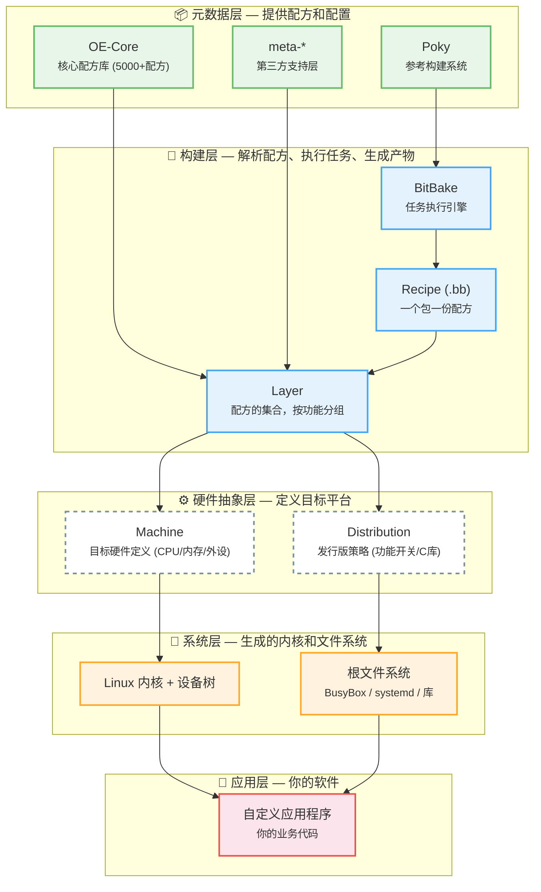
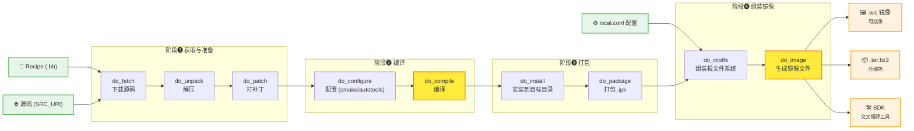
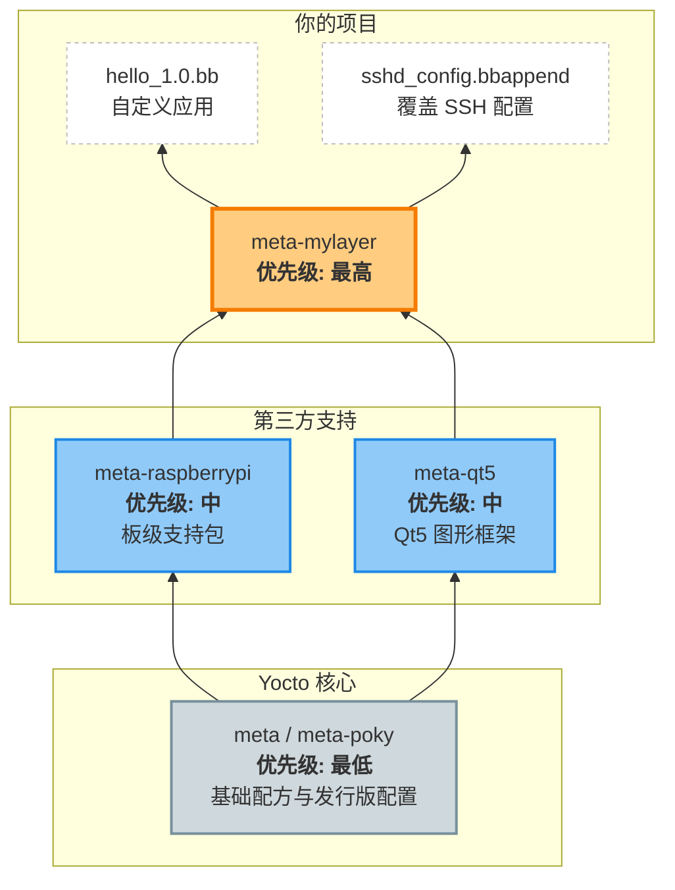

# Yocto 概述

## 概述

Yocto 是一个**开源协作项目**，提供模板、工具和方法来创建定制 Linux 系统。它不是 Linux 发行版，而是一套**构建系统**，用于为嵌入式设备、IoT、工业控制等场景生成自定义 Linux 系统。

### 一句话理解

> Yocto = 一个可以让你像搭积木一样定制嵌入式 Linux 系统的工具集合

---

## 核心概念详解

### Poky（参考构建系统）

Poky 是 Yocto 的**参考构建系统**，类似于一个"样板工程"。你 git clone 下来的就是它。

**Poky = BitBake（引擎）+ OE-Core（配方库）+ meta-poky（发行版配置）+ meta-yocto-bsp（板级支持）**

| 组件 | 角色 | 类比 |
|------|------|------|
| **BitBake** | 任务执行引擎（Python 写的） | 厨师的脑子 |
| **OE-Core**（OpenEmbedded-Core） | 5000+ 个核心 Recipe 和 Class | 基础菜谱库 |
| **meta-poky** | Poky 发行版的默认配置 | 餐厅的招牌菜单 |
| **meta-yocto-bsp** | QEMU 等参考硬件的板级支持 | 店里的标准灶台 |

**版本分支**：`scarthgap`（当前 LTS）、`styhead`（最新）、`kirkstone`（上一个 LTS）

---

### BitBake（任务执行引擎）

BitBake 是 Yocto 的**心脏**，它是用 Python 编写的任务执行引擎，类似 `make` 但专为嵌入式构建设计。

**核心能力**：
- **解析 Recipe** —— 读取 `.bb` 文件，理解每个包要怎么做
- **依赖分析** —— 自动计算 Recipe 之间的依赖关系，决定构建顺序
- **并行执行** —— 通过 `BB_NUMBER_THREADS` 控制并行度
- **任务缓存** —— 已构建过的包保存到 sstate-cache，下次跳过

**典型任务链**（每个 Recipe 经历以下生命周期）：
```
do_fetch → do_unpack → do_patch → do_configure → do_compile 
→ do_install → do_package → do_package_write_ipk → do_build
```

**常用操作示例**：
```
bitbake core-image-minimal       # 构建完整镜像
bitbake hello -c fetch           # 只下载 hello 的源码
bitbake hello -c devshell        # 进入 hello 的交互式编译环境
bitbake -s | grep python         # 搜索所有含 python 的包
bitbake -g core-image-minimal    # 生成依赖图（dot 格式）
```

---

### Recipe（配方）

Recipe 是 Yocto 中最基本的单位，**一个 Recipe 定义一个软件包如何被构建**。

**文件命名**：`<包名>_<版本号>.bb`，例如 `hello_1.0.bb`

**典型内容**（一个完整的 Recipe 示例）：

```bitbake
# hello_1.0.bb —— 最简单的 Recipe
SUMMARY = "简单的 Hello World 程序"       # 简短描述
DESCRIPTION = "一个演示 Recipe 编写的示例程序"  # 详细描述
LICENSE = "MIT"                            # 许可证类型
LIC_FILES_CHKSUM = "file://${COMMON_LICENSE_DIR}/MIT;md5=..."  # 许可证校验

SRC_URI = "file://hello.c"                 # 源码来源（可本地/HTTP/Git）

S = "${WORKDIR}"                            # 源码目录

do_compile() {                              # 编译任务
    ${CC} ${CFLAGS} ${LDFLAGS} hello.c -o hello
}

do_install() {                              # 安装任务
    install -d ${D}${bindir}
    install -m 0755 hello ${D}${bindir}
}
```

**关键变量**：
| 变量 | 含义 | 示例值 |
|------|------|--------|
| `S` | 源码目录 | `${WORKDIR}` |
| `D` | 目标根目录（安装时用） | `${WORKDIR}/image` |
| `WORKDIR` | 任务工作目录（临时文件放这里） | `tmp/work/qemux86-64-poky-linux/hello/1.0-r0/` |
| `bindir` | 二进制文件安装路径 | `/usr/bin` |
| `sysconfdir` | 配置文件安装路径 | `/etc` |

---

### Layer（层）

Layer 是 **Recipe 和配置文件的集合，按功能打包**。Yocto 的所有功能都以 Layer 为单位组织。

**命名规范**：`meta-` 前缀，如 `meta-raspberrypi`、`meta-qt5`、`meta-openembedded`

**一个 Layer 的标准目录结构**：
```
meta-mylayer/
├── conf/
│   ├── layer.conf           ← Layer 配置文件（必须）
│   └── machine/             ← 机器定义文件
│       └── myboard.conf
├── recipes-example/         ← Recipe 目录（按功能名组织）
│   └── hello/
│       └── hello_1.0.bb
├── recipes-kernel/          ← 内核相关 Recipe
├── recipes-bsp/             ← 板级支持 Recipe
├── recipes-connectivity/    ← 网络连接相关
├── files/                   ← 公共文件
└── README                   ← 说明文档
```

**常见 Layer 一览**：
| Layer | 功能 |
|-------|------|
| `meta` | OE-Core 核心层（5000+ Recipe） |
| `meta-poky` | Poky 发行版配置 |
| `meta-yocto-bsp` | QEMU/参考硬件的板级支持 |
| `meta-raspberrypi` | 树莓派全系列支持 |
| `meta-qt5` | Qt5 图形框架 |
| `meta-openembedded` | 社区维护的额外包（meta-oe、meta-networking 等） |
| `meta-ti` | TI 芯片（AM335x、AM62x 等）支持 |

---

### Machine（机器）

Machine 定义**目标硬件平台是什么**。Yocto 通过 Machine 知道要交叉编译成什么架构、用什么内核、加载哪些驱动。

**一个 Machine 配置文件的例子**：
```bitbake
# conf/machine/qemux86-64.conf
require conf/machine/include/x86-base.inc

MACHINE = "qemux86-64"                          # 机器名
PREFERRED_PROVIDER_virtual/kernel = "linux-yocto"  # 使用哪个内核
SERIAL_CONSOLES = "115200;ttyS0 115200;ttyS1"   # 串口配置
SERIAL_CONSOLES_CHECK = "${SERIAL_CONSOLES}"
MACHINE_FEATURES = "screen keyboard"            # 硬件特性

# 内核设备树
KERNEL_DEVICETREE = "qemu/qemu64.dtb"
```

**Machine 影响什么**：
- 交叉编译目标架构（arm64 / x86-64 / riscv64）
- Linux 内核版本和配置
- Bootloader（U-Boot / GRUB）
- 设备树文件
- 串口、显示等硬件参数

---

### Distribution（发行版）

Distribution 定义**系统的整体风格和行为策略**。它控制你的系统"长什么样"。

**一个发行版配置的例子**：
```bitbake
# conf/distro/my-distro.conf
DISTRO_NAME = "My Embedded Linux"                # 发行版名称
DISTRO_VERSION = "1.0"                           # 版本号
DISTRO_FEATURES = "alsa bluetooth wifi usb"      # 开启哪些功能

# 选择初始化系统
VIRTUAL-RUNTIME_init_manager = "systemd"         # 使用 systemd
DISTRO_FEATURES:append = " systemd"              # 开启 systemd 支持

# 选择 C 库
LIBC = "glibc"                                   # 用 glibc（或 musl 更小）
```

**常见的 DISTRO_FEATURES**：
| 特性 | 说明 |
|------|------|
| `alsa` | 音频支持 |
| `bluetooth` | 蓝牙支持 |
| `wifi` | 无线网络 |
| `usb` | USB 设备 |
| `systemd` | systemd 初始化 |
| `x11` / `wayland` | 图形显示 |
| `nfs` | 网络文件系统 |
| `pam` | 认证模块 |

---

### Image（镜像）

Image 是**最终构建产物**——它就是你烧录到设备上的完整系统。Image 本身也是一个 Recipe，只是它的"输出"是一个完整的根文件系统。

**常用预置镜像**：
| 镜像名 | 内容 | 大小 |
|--------|------|------|
| `core-image-minimal` | 最小系统，仅有 BusyBox + 基本工具 | ~20MB |
| `core-image-base` | 最小 + 基础硬件支持 | ~50MB |
| `core-image-full-cmdline` | 完整命令行工具集 | ~100MB |
| `core-image-sato` | 带 GUI 桌面环境 | ~200MB |
| `core-image-weston` | Wayland 显示服务器 | ~150MB |

**自定义镜像示例**（可以在你的 Layer 中定义）：
```bitbake
# my-image.bb
inherit core-image

IMAGE_INSTALL = " \
    packagegroup-core-boot \      # 基础启动包
    packagegroup-base \           # 基础库
    openssh \                     # SSH 服务
    hello \                       # 刚才写的 hello 程序
    my-custom-app \               # 你的应用
"

IMAGE_FSTYPES = "ext4 tar.bz2 wic"  # 生成的镜像格式
```

---

## Poky 目录结构

当你 `git clone git://git.yoctoproject.org/poky` 并 `source oe-init-build-env` 后，完整的项目结构如下：

```
poky/                           ← Poky 根目录（git clone 下来的）
│
├── bitbake/                    ← BitBake 引擎源码
│   ├── bin/
│   │   └── bitbake             ← bitbake 命令入口
│   └── lib/                    ← BitBake Python 库
│
├── meta/                       ← OE-Core：核心 Recipe 和 Class
│   ├── conf/
│   │   ├── bitbake.conf        ← 全局默认变量
│   │   └── machine/            ← 内置 Machine 定义
│   ├── classes/                ← 内置 Class（*.bbclass）
│   │   ├── core-image.bbclass  ← 镜像构建类
│   │   ├── autotools.bbclass   ← autotools 构建
│   │   ├── cmake.bbclass       ← CMake 构建
│   │   ├── kernel.bbclass      ← 内核构建
│   │   ├── module.bbclass      ← 内核模块构建
│   │   └── ... 共 200+ 个 class
│   ├── recipes-core/           ← 核心包 Recipe
│   ├── recipes-kernel/         ← 内核 Recipe
│   ├── recipes-bsp/            ← 板级支持 Recipe
│   └── recipes-connectivity/   ← 网络工具 Recipe
│
├── meta-poky/                  ← Poky 发行版默认配置
│   └── conf/
│       └── distro/
│           └── poky.conf       ← Poky 发行版配置
│
├── meta-yocto-bsp/             ← 参考板级支持（QEMU）
│   └── conf/machine/
│       ├── qemux86-64.conf     ← QEMU x86-64 机器定义
│       ├── qemuarm64.conf      ← QEMU ARM64 机器定义
│       └── ...                 ← 其他 QEMU 机器
│
├── scripts/                    ← 辅助脚本
│   ├── oe-init-build-env       ★ 初始化构建环境（最常用）
│   └── runqemu                 ★ 启动 QEMU 模拟器
│
└── build/                      ← 构建输出目录（source 后自动生成）
    ├── conf/
    │   ├── local.conf          ★ 你的本地构建配置
    │   └── bblayers.conf       ★ Layer 设置（告诉 BitBake 哪些层可用）
    └── tmp/                    ★ 所有构建产物
        ├── deploy/             ★ 最终产物（镜像、包、SDK）
        ├── work/               ★ 每个 Recipe 的工作目录
        └── log/                ★ 构建日志
```

> ⭐ **加星标** 的文件和目录是你最常用的，后续学习中你会频繁跟它们打交道。

### 🏗️ 架构分层



> 💡 **烹饪类比**：把 Yocto 想象成做菜——
> - **Poky** = 菜谱模板合集
> - **Recipe** = 一道菜的菜谱（番茄炒蛋怎么做）
> - **Layer** = 一个菜系的文件夹（川菜/粤菜）
> - **BitBake** = 厨师长，按菜谱指挥调度
> - **Machine** = 给哪个灶台做饭（电磁炉/燃气灶）
> - **Image** = 最终上桌的菜

### ⚙️ 构建流程



### 🔀 Layer 叠加与优先级



> **Layer 叠加原理**：多个 Layer 按优先级从低到高叠加。高优先级 Layer 中的 Recipe 会覆盖低优先级的同名 Recipe。你只需在 `meta-mylayer` 放自定义内容，其余复用 Yocto 和第三方 Layer。

---

## 与 Buildroot 对比

| 特性 | Yocto | Buildroot |
|------|-------|-----------|
| 学习曲线 | 陡峭 | 平缓 |
| 灵活性 | 极高 | 中等 |
| 包数量 | 上万 | 数千 |
| 构建时间 | 长 | 短 |
| 企业使用 | 广泛 | 较少 |
| 适用场景 | 复杂产品 | 简单设备 |

---

## 版本命名规则

Yocto 版本以动物命名，按字母顺序：
- `scarthgap`（当前 LTS 版本）
- `mickledore`
- `kirkstone`（上一个 LTS）

---

## 要点

1. **Yocto 是构建系统，不是发行版** — 它帮你"做"Linux，不是直接"用"Linux
2. **Layer 是模块化核心** — 每个功能独立分层，方便复用和维护
3. **BitBake 是心脏** — 所有构建任务都由它编排执行
4. **Recipe 是基本单元** — 每个软件包有自己的一份"简历"
5. **学习曲线陡峭但值得** — 掌握后可以精确控制 Linux 系统的每个方面

---

## 参考

- [Yocto 官方手册](https://docs.yoctoproject.org/)
- [Yocto Overview and Concepts Manual](https://docs.yoctoproject.org/overview-manual/)
- [BitBake 用户手册](https://docs.yoctoproject.org/bitbake/)
- [OE-Core 源码](https://github.com/openembedded/openembedded-core)
- [Poky 源码](https://git.yoctoproject.org/poky)
